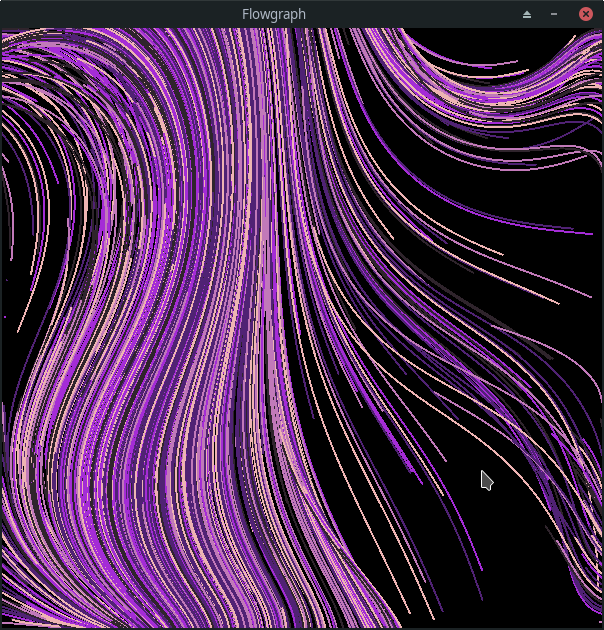
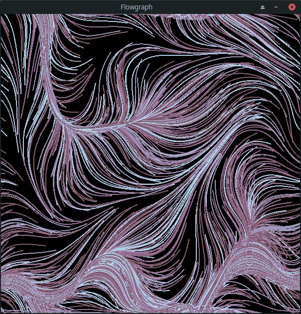

# Flowgraph
Flowgraph generates a graph of nodes with random vectors representing the acceleration
of particles. The acceleration values are generated with simplex noise.

## Running
To run the program, run the following command.
```bash
go run *.go
```

## Controls
`Esc` - Exits the program

`r` - Restarts the grid/particles

### Examples





